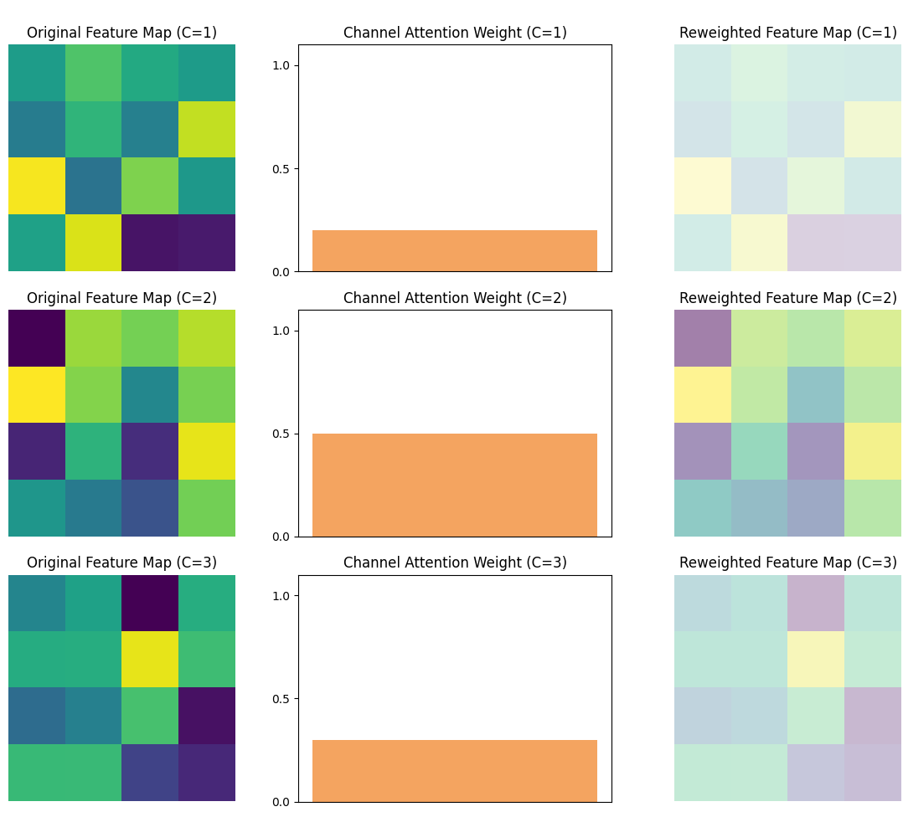
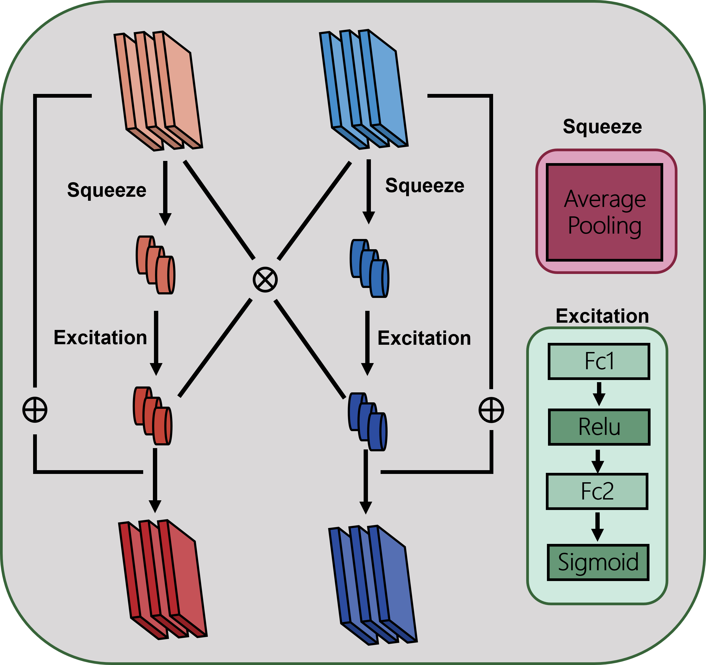
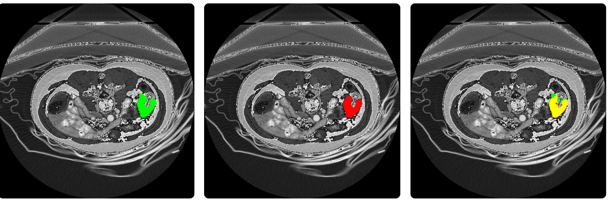
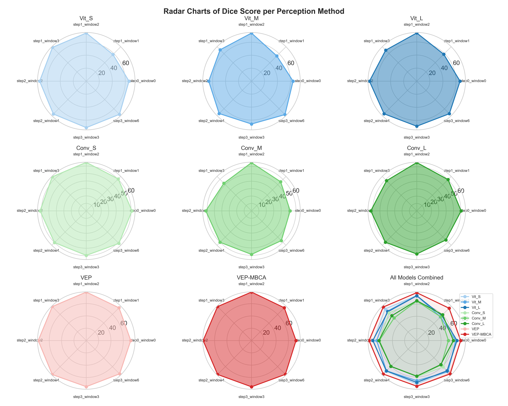
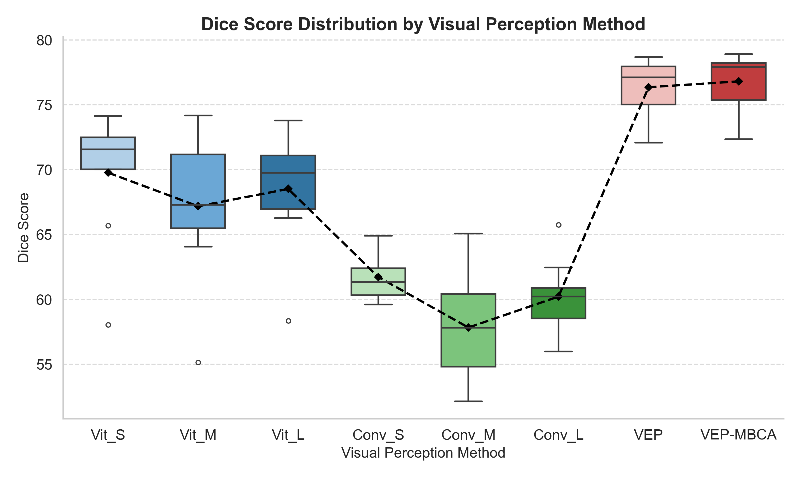

## Visual Perception-Enhanced Segmentation

### Project Introduction

This project introduces a novel **Visual Perception-Enhanced Segmentation Method**.

Its contributions include:

* **Effective Data Preprocessing**: The method analyzed the Hounsfield Unit (HU) distribution in the lesion regions of a publicly available colorectal tumor CT medical image dataset and designed a targeted preprocessing pipeline. This includes intensity truncation based on HU value distribution and noise cropping using a lightweight object detection model to remove non-tissue areas and irrelevant instrument interference.

* **Lightweight 2.5D Data Structure with slice-wise attention mechanism** is proposed, enabling lightweight yet semantically rich spatial representation by stacking adjacent slices along the channel dimension. This mechanism dynamically models the contribution of different slices(Channels with lower transparency in the "Reweighted Feature Map" indicate higher attention weights).

* **Enhanced Visual Perception Mechanism (VEP)**: A mechanism for collaborative modeling of long-range global pixel dependencies and multi-scale local texture information was developed. This involves a **dual-branch co-attention mechanism** for adaptive feature fusion, enhancing representation capabilities for different scale regions and improving segmentation accuracy in complex backgrounds and blurry edges.

Experimental results demonstrate that this method significantly improves segmentation accuracy and stability while maintaining low model complexity, offering a new solution for lightweight, high-precision medical image segmentation.

## Mathematical Notations

**Hounsfield Unit (HU) Formula**:
                                                                                           $$HU=1000\times\frac{\mu-\mu_{water}}{\mu_{water}}$$
Where $\mu$ is the linear attenuation coefficient of the medium, and $\mu_{water}$ is the linear attenuation coefficient of water.

**Normalization Formula**:
                                                                                  $$x_{norm}=\frac{clip(x,HU_{min},HU_{max})-HU_{min}}{HU_{max}-HU_{min}}$$
Where $x$ is the original pixel value, and $HU_{min}$ and $HU_{max}$ are set to clip values outside the 0.05% tails of the distribution

## Results

Below are visualizations of the segmentation results.

**Color Key for Segmentation Overlay**:

* **Green**: Indicates False Negatives (missed detection).
* **Red**: Indicates False Positives (over-detection).
* **Yellow**: Indicates Correct Predictions (intersection of ground truth and prediction).

