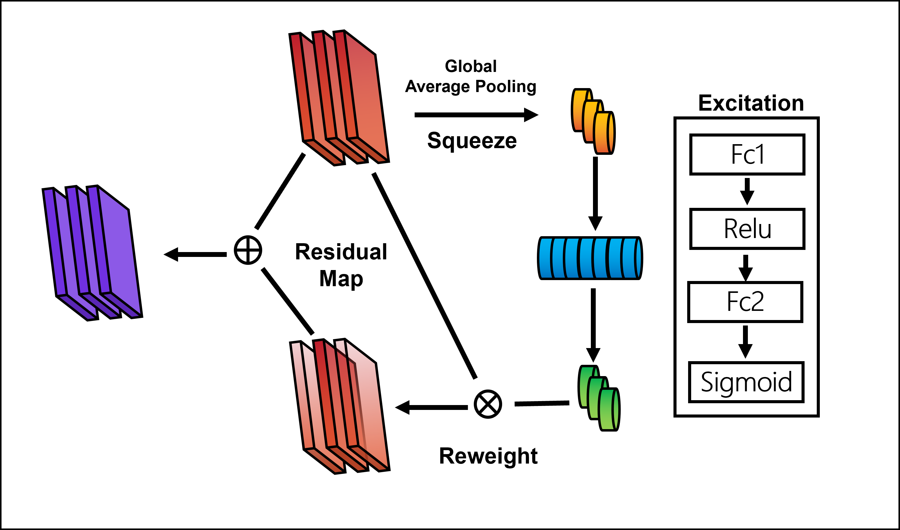

## Visual Perception-Enhanced Segmentation

---

## 🧠 Project Overview

This project introduces a novel **Visual Perception-Enhanced Segmentation** framework designed for lightweight and accurate medical image segmentation. It focuses on preprocessing, slice-wise attention, and collaborative dual-branch perception to enhance robustness and precision.

---

## 🔧 Contributions Overview

### 1. 🧼 Effective Data Preprocessing

This method analyzes the Hounsfield Unit (HU) distribution from a colorectal tumor CT dataset, and designs a two-step preprocessing pipeline:

- **HU-based intensity truncation**
- **Noise cropping using object detection**

  

<em>Figure 1. Data preprocessing pipeline for HU clipping and noise removal.</em>

---

### 2. 🧠 Lightweight 2.5D Slice-Wise Attention

We propose a 2.5D data structure where adjacent slices are stacked as channels. A slice-wise attention module dynamically reweights each channel to focus on informative regions.

  

<em>Figure 2. Slice-wise attention mechanism highlights important slices.</em>

  

<em>Figure 3. Visualization of slice-level attention weights.</em>

---

### 3. 🧩 Enhanced Visual Perception Module 

We design a **dual-branch co-attention mechanism** to fuse global context and multi-scale local texture features, enabling strong segmentation under complex conditions.

  

<em>Figure 4. Visual perception module combining long-range and local texture cues.</em>

---

## 🧮 Mathematical Notations

### Hounsfield Unit (HU):

​                                                                  $$HU=1000\times\frac{\mu-\mu_{water}}{\mu_{water}}$$

Where:
- $\mu$: Attenuation coefficient of tissue  
- $\mu_{water}$: Attenuation coefficient of water

### Normalization:

​                                                          $$x_{norm}=\frac{clip(x,HU_{min},HU_{max})-HU_{min}}{HU_{max}-HU_{min}}$$

Where $HU_{min}$ and $HU_{max}$ are clipped based on the 0.05% percentile tails.

---

## 📊 Experimental Results

### ✅ Visual Segmentation Results

The following visualizations demonstrate segmentation overlays and prediction reliability:

  

<em>Figure 5. Prediction overlay: green (FN), red (FP), yellow (TP).</em>

---

### 📈 Quantitative Comparisons

  

<em>Figure 6. Radar plot comparing evaluation metrics across methods.</em>

  

<em>Figure 7. Dice coefficient distribution across test samples.</em>

